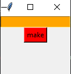

# 🪗My old password generator
- easy to use
- first put the lenght of the password you want to generate
- then click make
- you can not copy or paste the password so unfortuantly you should write it

---
## 🧑‍🎨UI of the app

---
## 👨‍💻Used Technologies
- tkinter
- python
- subprocess
- random
